# Backend / DB ERD Review

## Goal

AI Entertainment Studio의 백엔드/DB는 캐릭터 중심 AI 엔터 플랫폼을 상용 운영할 수 있도록 설계한다.

초기 운영은 메인 4캐릭터 기준으로 시작하되, 구조는 캐릭터 수 증가, 유료 캐시 루미나, 선물 해금, 프리미엄 영상, 캐릭터챗 특수 기능, 자산 버전 관리를 견딜 수 있어야 한다.

## Domain Verdict

현재 제안된 도메인 분리는 적절하다.

- 계정: 사용자 식별, 로그인 수단, 프로필, 설정 분리
- 캐릭터: 공개 프로필과 운영/표현 프로필 분리
- 자산: 이미지, 영상, 음성, 썸네일을 공통 자산으로 관리
- 공개 콘텐츠: 숏폼과 지표를 캐릭터/자산과 느슨하게 연결
- 루미나 지갑: balance 컬럼이 아니라 계정 + 원장 구조
- 선물: 주문, 즉시 반응, 누적 해금, 장착 반영까지 별도 흐름
- 부스트/랭킹: 무료 좋아요와 유료 루미나 부스트를 합산해 메인픽과 운영 해금을 결정
- 프리미엄 영상: 상품, 자산, 사용자 해금 이력 분리
- 캐릭터챗: 세션/메시지와 유료 특수 기능 주문 분리

## ERD Overview

```mermaid
erDiagram
  users ||--o{ user_auth_accounts : has
  users ||--|| user_profiles : has
  users ||--|| wallet_accounts : owns
  wallet_accounts ||--o{ wallet_ledger : records
  wallet_accounts ||--o{ wallet_holds : reserves

  artists ||--|| artist_public_profiles : exposes
  artists ||--|| artist_visual_profiles : styles
  artists ||--|| artist_content_profiles : guides
  artists ||--o{ artist_assets : uses
  assets ||--o{ artist_assets : linked
  assets ||--o{ asset_versions : versions

  artists ||--o{ shortforms : publishes
  shortforms ||--o{ shortform_assets : contains
  shortforms ||--o{ shortform_metrics_daily : measures

  users ||--o{ gift_orders : sends
  artists ||--o{ gift_orders : receives
  gift_products ||--o{ gift_orders : ordered
  gift_products ||--o{ artist_gift_progress : unlocks
  artists ||--o{ artist_reaction_events : reacts
  artists ||--o{ artist_equipped_items : equips

  users ||--o{ artist_boost_events : boosts
  artists ||--o{ artist_boost_events : receives
  boost_campaigns ||--o{ artist_boost_events : counts
  boost_campaigns ||--o{ artist_ranking_snapshots : ranks
  boost_campaigns ||--o{ artist_main_picks : selects
  boost_campaigns ||--o{ artist_unlock_campaigns : unlocks

  premium_video_products ||--o{ premium_video_assets : includes
  users ||--o{ user_premium_video_unlocks : unlocks

  users ||--o{ chat_sessions : starts
  artists ||--o{ chat_sessions : joins
  chat_sessions ||--o{ chat_messages : contains
  chat_feature_products ||--o{ chat_feature_orders : ordered
```

## Table Review

### Keep

- `wallet_accounts`, `wallet_ledger`, `wallet_holds`
  - 상용화 기준에서 필수다.
  - 충전, 사용, 환불, 보정, 이벤트 지급을 모두 원장으로 남겨야 한다.

- `assets`, `asset_versions`, `artist_assets`
  - 이미지/영상 정책이 바뀌어도 자산 재사용이 가능하다.
  - 캐릭터 프로필, 숏폼, 프리미엄 영상, 선물 해금 이미지가 같은 자산 체계를 쓸 수 있다.

- `gift_orders`, `artist_gift_progress`, `artist_reaction_events`, `artist_equipped_items`
  - 단순 선물 결제가 아니라 즉시 반응과 누적 해금을 동시에 처리하기 위해 필요하다.

- `boost_campaigns`, `artist_boost_events`, `artist_ranking_snapshots`, `artist_main_picks`, `artist_unlock_campaigns`
  - 좋아요/부스트로 팬덤의 흐름을 만들고, 운영자가 회사 차원의 특별 해금을 걸 수 있다.
  - 선물은 직접 구매형 보상이고, 부스트는 랭킹/메인 노출/운영 이벤트 보상으로 분리한다.

- `chat_feature_products`, `chat_feature_orders`
  - 일반 채팅 전체 과금보다 특수 기능 과금 정책에 잘 맞다.

### Add / Clarify

- `user_entitlements`
  - 프리미엄 영상뿐 아니라 추후 멤버십, 이벤트 보상, 영구/기간제 권한을 통합하려면 권한 테이블이 필요하다.
  - MVP에서는 `user_premium_video_unlocks`만 써도 되지만, 상용 구조에서는 entitlement 개념을 두는 것이 낫다.

- `idempotency_keys`
  - 결제, 선물, 채팅 특수 기능 사용은 중복 요청 방지가 필수다.

- `audit_events`
  - 관리자 보정, 환불, 자산 교체, 캐릭터 공개 상태 변경을 추적해야 한다.

- `admin_users` 또는 운영자 권한 모델
  - 초기에는 앱 사용자와 운영자를 섞지 않는 편이 좋다.
  - 실제 백오피스가 붙을 때 `admin_users`, `admin_roles`, `admin_audit_events`로 확장한다.

### Maybe Later

- `artist_followers`
  - 커뮤니티/팬덤 기능을 시작할 때 추가한다.

- `memberships` / `subscriptions`
  - 현재 수익모델이 루미나 중심이면 1차 개발 범위에서 제외한다.

- `content_moderation_events`
  - UGC나 사용자 생성 채팅 공개 기능이 생기면 필요하다.

## Important Modeling Decisions

### 1. 루미나 잔액

`users.lumina_balance`는 두지 않는다.

현재 잔액은 `wallet_ledger`의 확정 원장 합계로 계산하거나, 성능이 필요하면 `wallet_accounts.cached_balance`를 원장 트랜잭션과 같은 DB 트랜잭션 안에서만 갱신한다.

### 2. 공개 데이터와 내부 데이터

공개 페이지에 노출되는 값은 `artist_public_profiles`, `artist_visual_profiles`, `artist_content_profiles`에 둔다.

내부 운영 메모, 생성 프롬프트, 원본 파일 위치, 정산 관련 값은 공개 테이블에 두지 않는다.

### 3. 선물 구조

일반 선물은 `gift_products.gift_kind = 'instant'`로 두고, 구매 성공 후 `artist_reaction_events`를 생성한다.

프리미엄 선물은 `gift_kind = 'progressive'`로 두고, 구매 성공 후 `artist_gift_progress.current_amount`를 증가시킨다. 목표치 도달 시 `unlocked_at`을 기록하고, 필요하면 `artist_equipped_items`에 장착 상태를 반영한다.

### 4. 영상 과금

무료 숏폼은 `shortforms`에서 관리한다.

유료 영상은 `premium_video_products`와 `user_premium_video_unlocks`에서 관리한다. 프리미엄 영상 자산 자체는 `assets`에 있고, 상품과의 연결은 `premium_video_assets`가 담당한다.

### 5. 캐릭터챗 과금

`chat_sessions`, `chat_messages`는 일반 채팅 흐름을 담는다.

특별 답변, 음성 답장, 이미지형 응답, 특별 대사는 `chat_feature_products`와 `chat_feature_orders`로 주문/차감한다. 메시지에는 어떤 유료 기능으로 생성됐는지 `chat_messages.chat_feature_order_id`로 연결한다.

### 6. 좋아요 / 부스트 / 메인픽

무료 좋아요와 유료 부스트는 모두 `artist_boost_events`에 기록한다.

무료 좋아요는 `boost_type = 'free_like'`, 유료 부스트는 `boost_type = 'lumina_boost'`로 구분한다. 유료 부스트는 반드시 `wallet_ledger_id`와 연결해 루미나 차감을 추적한다.

랭킹은 실시간 집계만 믿지 않고 `artist_ranking_snapshots`에 기간별 결과를 저장한다. 메인 노출 캐릭터는 `artist_main_picks`에 기록해 "이번 주 팬들이 올린 메인픽"을 재현할 수 있게 한다.

특별 해금은 선물 누적 해금과 다르게 `artist_unlock_campaigns`와 `artist_unlock_rewards`로 관리한다. 의미는 "팬들이 투표/부스트해줬으니 회사 차원에서 열어주는 보상"이다.

## Development Priority

### Phase 1: 상용 기반 골격

1. 계정: `users`, `user_auth_accounts`, `user_profiles`, `user_settings`
2. 캐릭터 공개 모델: `artists`, `artist_public_profiles`, `artist_visual_profiles`
3. 자산 모델: `assets`, `asset_versions`, `artist_assets`
4. 루미나 지갑: `wallet_accounts`, `wallet_ledger`, `lumina_products`, `payment_orders`, `payment_transactions`

### Phase 2: 유료 기능 MVP

1. 선물 상품/주문: `gift_products`, `gift_orders`
2. 즉시 반응: `artist_reaction_events`
3. 누적 해금: `artist_gift_progress`, `artist_equipped_items`
4. 부스트/랭킹: `boost_campaigns`, `artist_boost_events`, `artist_ranking_snapshots`, `artist_main_picks`
5. 프리미엄 영상: `premium_video_products`, `premium_video_assets`, `user_premium_video_unlocks`

### Phase 3: 캐릭터챗 상용화

1. `chat_personas`, `chat_sessions`, `chat_messages`
2. `chat_feature_products`, `chat_feature_orders`
3. 메시지별 비용 추적, 모델 응답 메타데이터, 안전 필터 결과 저장

### Phase 4: 운영/정산/확장

1. `audit_events`, `idempotency_keys`
2. 관리자 백오피스 권한
3. 일별 지표 집계: `shortform_metrics_daily`, 캐릭터별 매출/선물/채팅 지표
4. 환불/보정 자동화와 CS 도구

## Over / Under Check

### 과하지 않은 것

- 원장 기반 지갑
- 자산 공통 도메인
- 선물 진행도와 장착 분리
- 부스트와 선물 도메인 분리
- 프리미엄 영상 해금 이력 분리

이 네 가지는 지금 넣어야 나중에 유료 구조를 갈아엎지 않는다.

### 1차 개발에서 미뤄도 되는 것

- 구독/멤버십
- 복잡한 운영자 역할 체계
- 팬 팔로우/커뮤니티
- 광고 캠페인 정산 테이블
- 추천/랭킹 피드 테이블

### 부족하면 위험한 것

- 결제/주문 idempotency
- 원장 불변성
- 환불 상태 추적
- 자산 버전 이력
- 유료 해금 이력
- 관리자 변경 감사 로그
